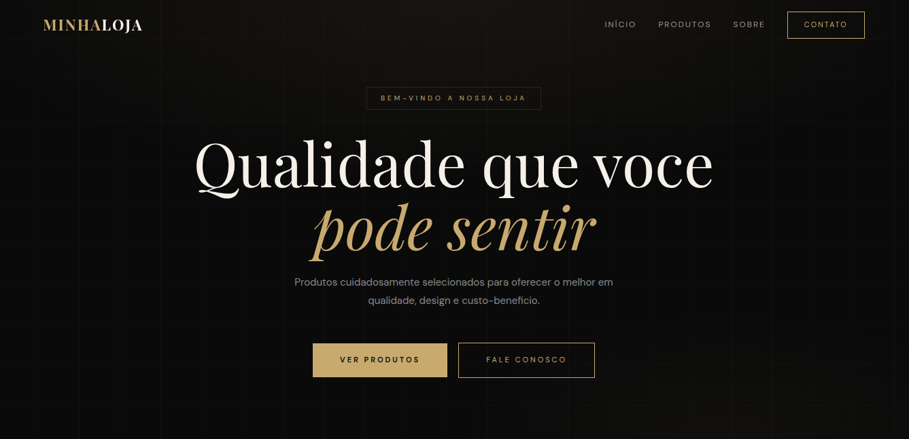
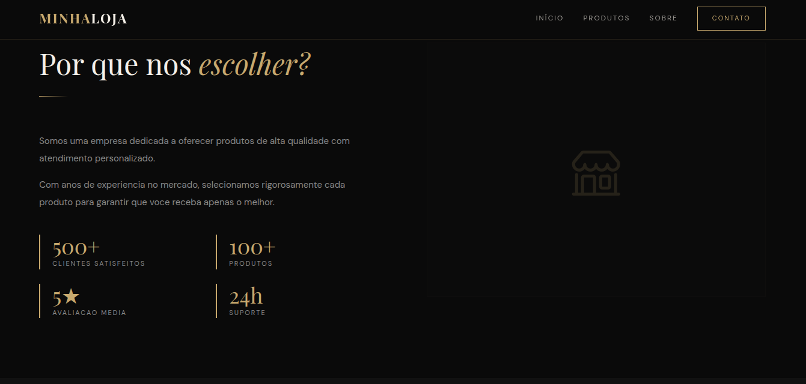
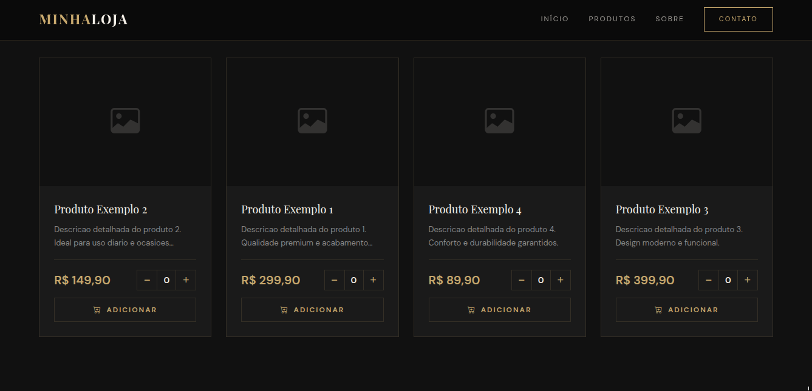
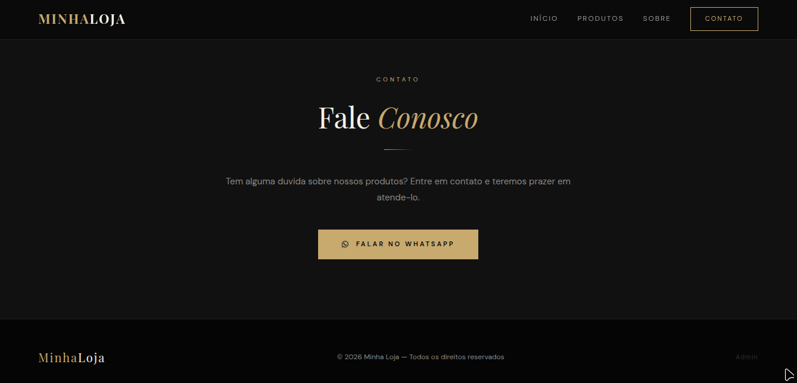

# 🛍️ Sistema de Catálogo de Produtos

  <strong>🛍️ Product Catalog System</strong> 
  <em>Web system for product listing and administrative management</em>

🇧🇷 Português \| 🇺🇸 English

------------------------------------------------------------------------

## 🚀 Sobre o projeto

Sistema web desenvolvido em PHP para gerenciamento de catálogo de
produtos com painel administrativo, permitindo cadastro, edição e
exibição de produtos de forma simples e eficiente.

------------------------------------------------------------------------

## ✨ Funcionalidades

-   📦 Listagem de produtos
-   ⭐ Destaque de produtos
-   🔐 Autenticação de administrador
-   ⚙️ Painel administrativo
-   🖼️ Upload de imagens
-   📱 Integração com WhatsApp
-   🗂️ Organização por estrutura modular

------------------------------------------------------------------------

## 🛠️ Tecnologias utilizadas

-   PHP
-   MySQL
-   PDO
-   HTML / CSS
-   Bootstrap Icons

------------------------------------------------------------------------

## 📁 Estrutura do projeto

admin/ components/ config/ public/ banco.sql index.php

------------------------------------------------------------------------

## ⚙️ Instalação e execução

### 1. Clone o repositório

git clone https://github.com/cauac-ops/sistema-catalogo-loja.git\
cd sistema-catalogo-loja

### 2. Configure o banco de dados

Importe o arquivo banco.sql

### 3. Configure o ambiente

Crie um arquivo .env baseado no .env.example:

DB_HOST=localhost\
DB_NAME=seu_banco\
DB_USER=seu_usuario\
DB_PASS=sua_senha\
WHATSAPP=5511999999999

------------------------------------------------------------------------

## 🔐 Segurança

Este projeto utiliza variáveis de ambiente para proteger dados
sensíveis.

⚠️ O arquivo .env não deve ser enviado para o repositório.

------------------------------------------------------------------------
## 📸 Preview

  

  

  

  

------------------------------------------------------------------------

## 📈 Melhorias futuras

-   🔎 Busca de produtos
-   📊 Dashboard com estatísticas
-   📦 Paginação
-   🔐 Recuperação de senha
-   🛡️ Proteção CSRF

------------------------------------------------------------------------

## 📄 Licença

Distribuído sob a licença MIT.
