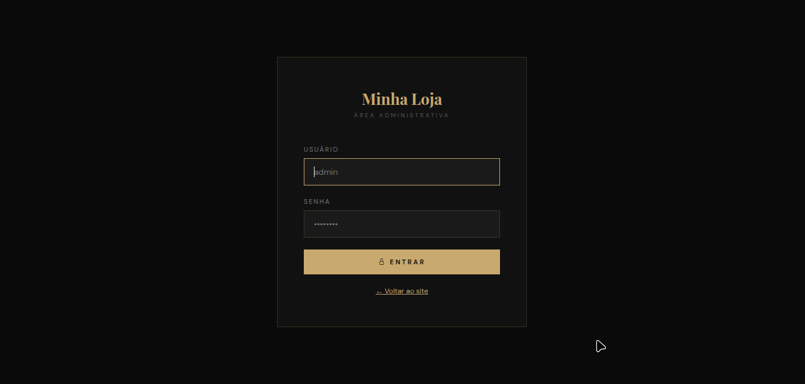
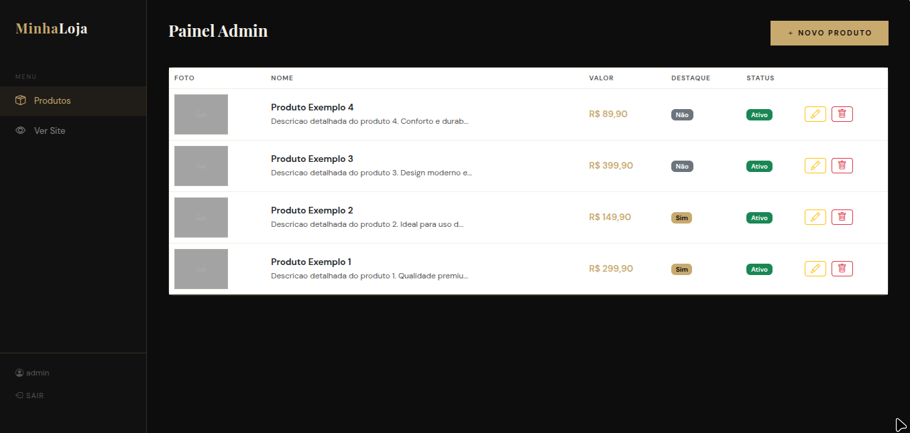

# 🛍️ Sistema de Catálogo de Produtos

<p align="center">
  <strong>🛍️ Product Catalog System</strong><br>
  <em>Sistema web para exibição e gerenciamento de produtos com painel administrativo</em>
</p>

<p align="center">
  🇧🇷 Português | 🇺🇸 <a href="#-english">English</a>
</p>

> > Sistema web completo para gerenciamento de catálogo de produtos, com área pública para exibição e painel administrativo para controle total do conteúdo.

<p align="center">
  
  
  
</p>

<p align="center">
  
  
  
</p>

---

## 🇧🇷 Português

## 🚀 Sobre o projeto

Sistema web desenvolvido em PHP para gerenciamento de catálogo de produtos com painel administrativo.

---

## 🧠 Objetivo do Projeto

Este projeto foi desenvolvido com foco em experiência do usuário (UI/UX) e agilidade de implementação.

Diferente do projeto AFP (sistema completo com regras de negócio e segurança mais robusta), aqui o objetivo foi demonstrar:

- Criação de interfaces modernas
- Interação dinâmica com JavaScript
- Integração com fluxo de vendas simples (WhatsApp)
- Estrutura leve para aplicações rápidas

Este projeto simula um cenário real onde a prioridade é velocidade e apresentação, e não complexidade de regras de negócio.

---

## 🛠️ Tecnologias utilizadas

- **Backend:** PHP  
- **Banco de dados:** MySQL  
- **Frontend:** HTML, CSS, Bootstrap  
- **Outros:** JavaScript

---

## 📸 Preview do sistema

### 🏠 Página inicial


### 🔐 Tela de login


### 📦 Cadastro de produtos


---

## 🧠 Conceitos aplicados

- CRUD completo de produtos  
- Autenticação de usuários (admin)  
- Proteção contra CSRF  
- Organização em camadas
  
---

## ✨ Funcionalidades

### 🛍️ Área pública
- Visualização de produtos cadastrados  
- Destaque de produtos na página inicial  

### ⚙️ Painel administrativo
- Cadastro, edição e exclusão de produtos (CRUD)  
- Upload de imagens dos produtos  
- Gerenciamento completo do catálogo  

### 🔐 Segurança
- Autenticação de administrador  
- Proteção contra acesso não autorizado
  
---

## ⚙️ Instalação e execução

### 1. Clone o repositório

```
git clone https://github.com/cauac-ops/sistema-catalogo-loja.git
cd sistema-catalogo-loja
```
2. Configure o ambiente
Instale um servidor local (XAMPP, Laragon ou WAMP)
Coloque o projeto na pasta htdocs (ou equivalente)

4. Banco de dados
Crie um banco no MySQL (ex: catalogo_loja)
Importe o arquivo .sql que está no projeto

5. Configuração
Edite o arquivo de conexão com o banco:
```
$host = "localhost";
$db   = "catalogo_loja";
$user = "root";
$pass = "";
```
5. Executar
Acesse no navegador:

http://localhost/sistema-catalogo-loja

---

## 📈 Melhorias futuras

- 🔎 Busca de produtos
- 📊 Dashboard
- 📦 Paginação
- 🔐 Recuperação de senha
- 🛡️ Proteção CSRF

---

## 📄 Licença

MIT License

---

## 🇺🇸 English

## 🚀 About the project

Complete web system for product catalog management, featuring a public interface for product display and an administrative panel for full content control.

---

## 🧠 Project Purpose

This project was developed with a focus on user experience (UI/UX) and rapid implementation.

Unlike the AFP project (a complete system with advanced business rules and stronger security), the goal here was to demonstrate:

- Modern and responsive interface design  
- Dynamic interactions using JavaScript  
- Integration with a simplified sales flow (WhatsApp)  
- A lightweight and efficient structure for fast deployment  

This project simulates a real-world scenario where speed, usability, and visual presentation are prioritized over complex business logic.

---

## 🛠️ Technologies

- **Backend:** PHP  
- **Database:** MySQL  
- **Frontend:** HTML, CSS, Bootstrap  
- **Others:** JavaScript  

---

## 📸 System Preview

### 🏠 Home page


### 🔐 Login page


### 📦 Product management


---

## 🧠 Concepts Applied

- Full product CRUD system  
- User authentication (admin)  
- CSRF protection  
- Layered architecture organization  

---

## ✨ Features

### 🛍️ Public area
- Product listing and visualization  
- Featured products on homepage  

### ⚙️ Admin panel
- Product CRUD (Create, Read, Update, Delete)  
- Image upload support  
- Full catalog management  

### 🔐 Security
- Admin authentication  
- Access control  

---

## ⚙️ Installation and Setup

### 1. Clone the repository

```
git clone https://github.com/cauac-ops/sistema-catalogo-loja.git
cd sistema-catalogo-loja
```

2. Configure environment
Install a local server (XAMPP, Laragon or WAMP)
Place the project inside the htdocs folder

4. Database
Create a MySQL database (e.g. catalogo_loja)
Import the .sql file from the project

5. Configuration
Edit the database connection file:

```
$host = "localhost";
$db   = "catalogo_loja";
$user = "root";
$pass = "";
5. Run the project
```
Access in your browser:

http://localhost/sistema-catalogo-loja

---

## 📈 Future Improvements
- 🔎 Product search
- 📊 Dashboard
- 📦 Pagination
- 🔐 Password recovery
- 🛡️ Enhanced security

---

## 📄 License

MIT License
